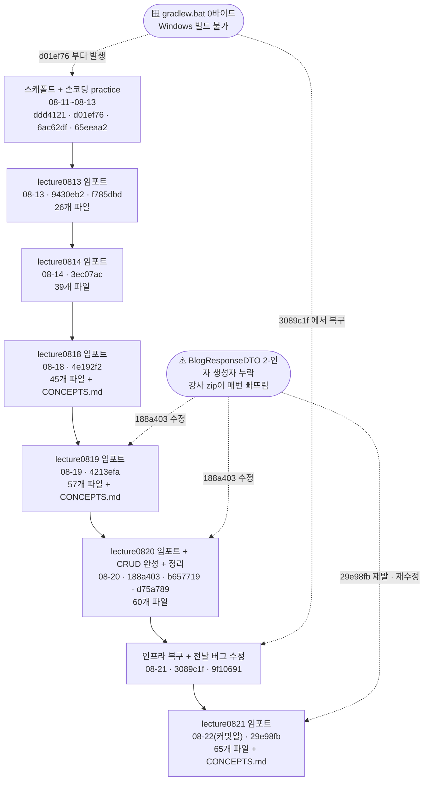
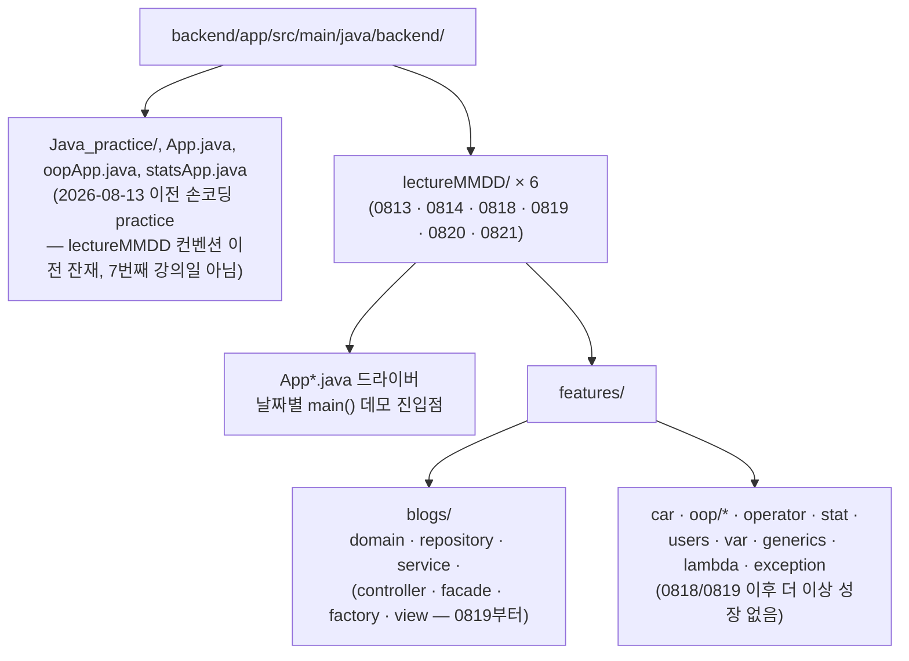
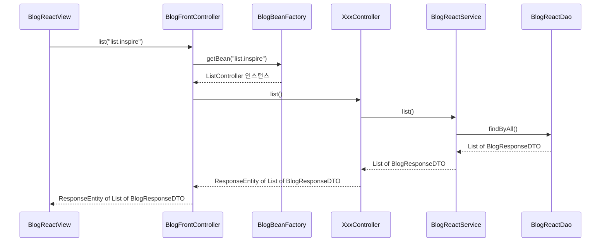
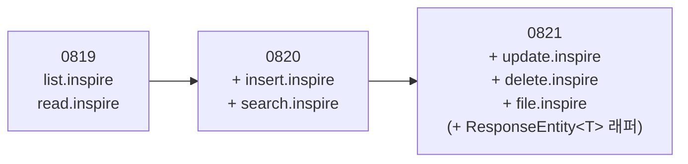

# backend

LG CNS Inspire 6기 백엔드(Java/Gradle) 강의 아카이브. 강사가 매 수업일 배포하는 소스 zip을
`backend.lectureMMDD` 패키지로 하루 단위로 반영해온 결과물이며, 특히 `features/blogs/**`는 여러 날에
걸쳐 계속 확장되어온 하나의 미니 애플리케이션이다. 이 문서는 git 커밋 로그를 다시 훑어보며 "코드가 어떤
순서로, 왜 그렇게 만들어졌는지"와 "날짜별로 어떤 개념이 쌓여왔는지"를 다이어그램 중심으로 정리한 것이다.

**빌드/실행**: JDK 21 toolchain(`app/build.gradle`), `./gradlew compileJava`로 컴파일. `application`
플러그인의 기본 실행 클래스는 `backend.App`(`mainClass = 'backend.App'`)이며, 각 `lectureMMDD` 패키지의
`XxxApp.java` 드라이버들은 개별적으로 `main()`을 가진 데모 진입점이다.
Windows에서는 `gradlew.bat`을 쓰되, 08-11~08-21 사이에 커밋되어 있던 버전은 0바이트로 깨져 있었으니(아래
"알려진 이슈" 참고) 그 시기 코드를 과거 커밋에서 되돌려 받는다면 유의할 것.

---

## 커밋 타임라인 / phase 흐름도

`dev` 브랜치 기준 선형 히스토리, backend 관련 첫 커밋은 `ddd4121`(2026-08-11)이다. 그 이전
(2026-07-28~08-11, 37개 커밋)은 별개의 프론트엔드(HTML/CSS/React) 학습 트랙이라 이 문서에서는 다루지
않는다. 아래 흐름도의 세로 체인이 "매일 zip 임포트" 본줄기이고, 점선으로 붙은 두 박스는 그 리듬만으로는
설명 안 되는 반복 유지보수 이슈다.

각 해시는 `git show --stat <hash>` / `git show <hash>`로 더 깊이 들여다볼 수 있다.

---

## 논리적 흐름

- **스캐폴드가 먼저다**: 어떤 zip도 반영하기 전에 Gradle 프로젝트 자체가 서 있어야 했고, 그 과정에서
  기존 손코딩 practice 파일들의 컴파일 오류부터 잡았다(`d01ef76`). 이때 추가된 Lombok이 이후 모든
  날짜 DTO의 전제 조건이 된다.
- **하루 단위 zip 임포트가 몸통이다**: 각 커밋은 그날 배포된 강사 zip을 `backend.lectureMMDD` 패키지로
  옮기는 것이 기본 동작(패키지/`import`만 재작성)이고, 이후 날짜 zip은 이전 날짜 파일을 대부분 그대로
  포함해 사실상 매일 "전날 + 오늘의 델타"에 가깝다.
- **`features/blogs/**`만 계속 진화한다**: 나머지 데모 패키지(`car`/`oop/*`/`operator`/`stat`/`users`/
  `var`/`generics`/`lambda`/`exception`)는 0818~0819 이후로 더 자라지 않는다. 블로그 기능만 실제
  리팩터링/기능추가가 반복되는 살아있는 코드베이스처럼 움직인다 — 아래 "blogs 미니 프레임워크
  아키텍처" 참고.
- **`9f10691`은 "새 기능"이 아니라 "빌드 복구"였다**: 0820에서 이미 완성한 것과 같은 `read` 기능을
  누군가 0819 패키지에 손으로 옮겨 적다가 문법 오류(`sout(...)`, `Interger parse(...)`, 존재하지 않는
  `ReadController` 참조)를 남겼고, 이 한 파일이 전체 모듈의 컴파일을 막고 있었다. 0820과 동일한
  패턴으로 마저 완성해 해소했다.

---

## 지식 기반 진행 (개념 로드맵)

App 드라이버 등장 순서(그날 처음 추가된 것, 누적):

| 날짜 | 새로 추가된 App 드라이버 | 비고 |
|---|---|---|
| 0813 | `App`, `AryApp`, `BlogApp`, `CarApp`, `GuessGameApp`, `OopApp`, `OperatorApp`, `StaticApp`, `StringApp`, `TeacherApp`, `VariableApp` | 최초 스냅샷(11개) |
| 0814 | `AbstractApp`, `EnumApp`, `TvClientApp` | 추상클래스, enum, 싱글턴/팩토리 |
| 0818 | `CollectionApp`, `GenericsApp`, `StreamApp` | 제네릭, Collections, 람다/Stream |
| 0819 | `BlogReactApp`, `ExceptionApp` | 예외 처리, Front Controller 프레임워크 |
| 0820 | `BlogStreamApp` | Streams API(filter/map/collect/groupingBy/Optional) |
| 0821 | `IOStreamApp` | I/O 스트림, 직렬화 |

`lecture0818`/`lecture0819`/`lecture0821`은 각각 자체 `CONCEPTS.md`를 갖고 있어 개념정리 + 예시 +
edge case까지 상세히 문서화되어 있다 — 깊이 있게 보려면 아래 링크를 따라가면 된다:

- [`lecture0818/CONCEPTS.md`](app/src/main/java/backend/lecture0818/CONCEPTS.md) — 제네릭, Collections API, 람다/함수형 인터페이스/Stream 등 §1~14 (변수~레이어드 아키텍처까지 그날 기준 누적 전체를 다룸)
- [`lecture0819/CONCEPTS.md`](app/src/main/java/backend/lecture0819/CONCEPTS.md) — 위 §1~14에 예외 처리(§15), Front Controller + Singleton Factory + DI(§16) 추가 (역시 누적 전체 문서)
- [`lecture0821/CONCEPTS.md`](app/src/main/java/backend/lecture0821/CONCEPTS.md) — 그날 새로 배운 것만: I/O 스트림, 객체 직렬화/역직렬화, 파일 영속성, CRUD 완성, `ResponseEntity<T>` 패턴(§1~6, 0813~0820 누적 개념은 다시 싣지 않고 위 문서를 참조하도록 되어 있음)

`lecture0813`/`lecture0814`/`lecture0820`은 아직 전용 `CONCEPTS.md`가 없다 — App 드라이버/패키지
구성으로 짐작할 수 있는 그날의 핵심 주제만 간단히 남긴다:
- **0813**: 변수·타입, 문자열 비교(`==` vs `.equals()`), 배열, 연산자/제어문, 생성자 오버로딩과 캡슐화,
  static 키워드, 상속(`PersonDTO`→`Student/Teacher/ManagerDTO`) 기초.
- **0814**: 추상 클래스/인터페이스(`Animal`/`Flyer`), enum, 싱글턴+팩토리 패턴(`TvClientApp`,
  `BeanFactory`) — `@SuperBuilder`로 상속 계층 DTO 빌더 확장.
- **0820**: `BlogStreamApp`의 Streams API 실전 활용(filter/map/collect/groupingBy/Optional) — 코드
  자체는 [`lecture0819/CONCEPTS.md`](app/src/main/java/backend/lecture0819/CONCEPTS.md)의 §12(람다/Stream)
  연장선.

---

## 패키지 / 디렉터리 구조도

매일 배포되는 원본 zip은 `package features...;`(레포 접두어 없음)로 되어 있고, 이를
`backend/app/src/main/java/backend/lectureMMDD/`로 옮기며 `package backend.lectureMMDD.features...;`로,
드라이버 클래스는 `package backend.lectureMMDD;`로 다시 쓴다(내부 `import features....` 구문도 동일하게
재작성). 6개 `lectureMMDD` 폴더 모두 아래와 같은 동일한 형태를 따른다:

---

## blogs 미니 프레임워크 아키텍처

`features/blogs/**`는 Front Controller + Singleton Factory + DI 패턴으로 짜여 있다. `list.inspire`
요청을 예로 든 호출 흐름:

`BlogBeanFactory`는 싱글턴(`getInstance()`)이며, 생성자에서 `BlogReactDao → BlogReactServiceImpl →
XxxController` 순으로 생성자 주입을 구성하고 `Map<endPoint, controller>`에 등록해둔다. `read`/`search`/
`insert`/`update`/`delete`/`file`도 같은 흐름을 타되 `XxxController`/엔드포인트만 바뀐다.

이 CRUD 엔드포인트 목록 자체가 날짜별로 늘어났다:

---

## 알려진 이슈 / 참고사항

- **`BlogResponseDTO` 2-인자 생성자 누락**: 강사 배포 zip의 `BlogResponseDTO`는 Lombok
  `@NoArgsConstructor`/`@AllArgsConstructor`만 갖고 있어 `OperatorDemo.register(...)`가 호출하는
  `new BlogResponseDTO(201, "OK")` 같은 2-인자 생성자가 없다. `lecture0819`/`lecture0820`/`lecture0821`
  모두 이 생성자를 직접 추가해 반영했다 — 새 lecture 폴더를 추가할 때도 `OperatorDemo.java`가 이
  패턴을 쓰는지 먼저 확인할 것.
- **Windows Gradle wrapper 이력**: `gradlew.bat`이 한때(08-11~08-21) 0바이트로 깨진 채 커밋되어 있었다.
  지금은 `gradlew wrapper --gradle-version 9.2.0`으로 복구된 상태(`3089c1f`)이지만, 과거 커밋을 직접
  체크아웃해 그 시절 코드를 실행해봐야 한다면 Windows에서는 동작하지 않는다는 점을 기억할 것(Unix
  `gradlew` 스크립트는 그 기간에도 항상 정상이었다).
- **`.LCK*.java~` 파일들**: 에디터(NetBeans 계열 Java 언어 서버)가 파일을 열어둔 동안 생성하는 잠금
  파일로, 내용이 비어 있고 git에 커밋된 적이 없다. 작업 중 종종 나타났다가 사라지므로 무시해도 된다.
